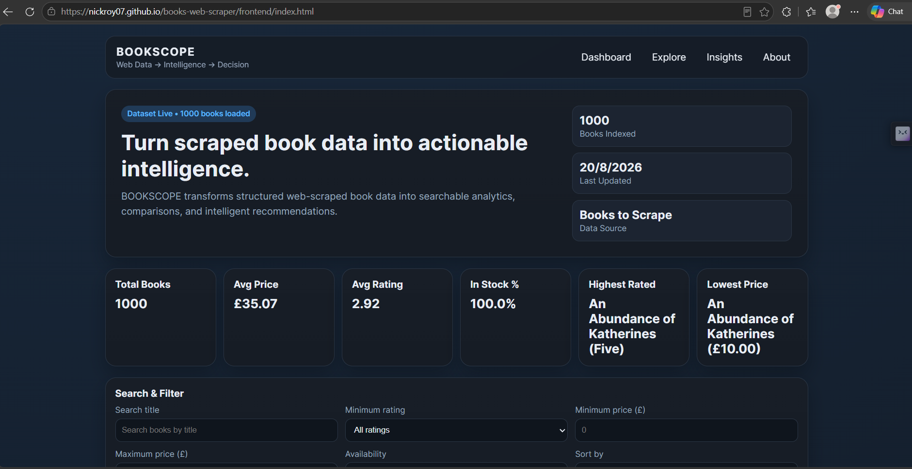
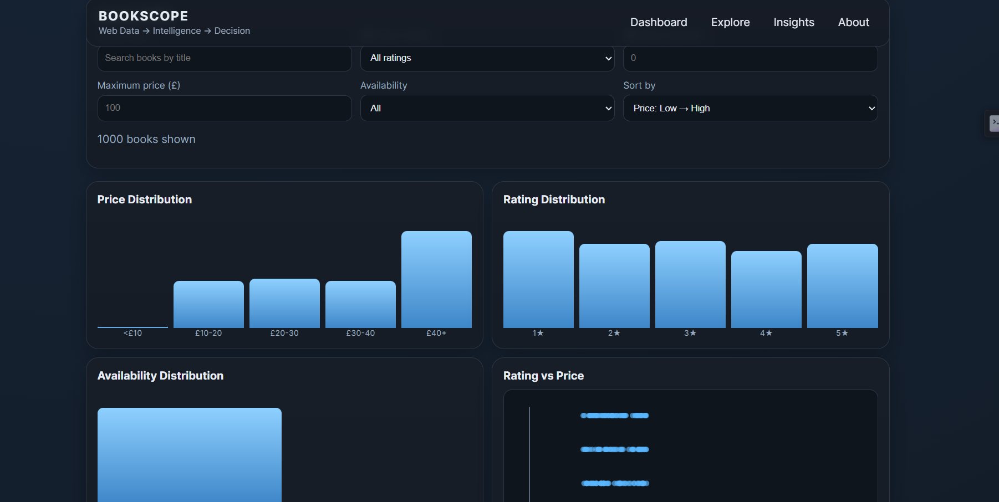
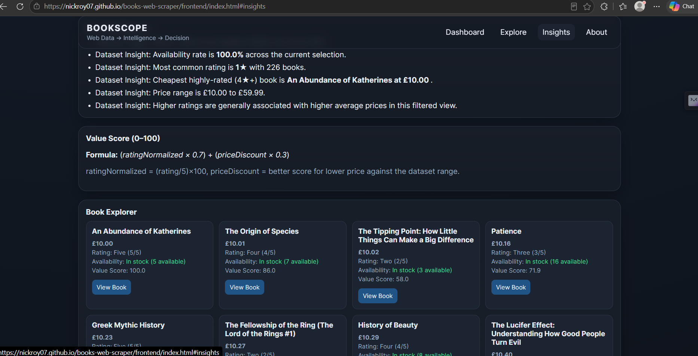
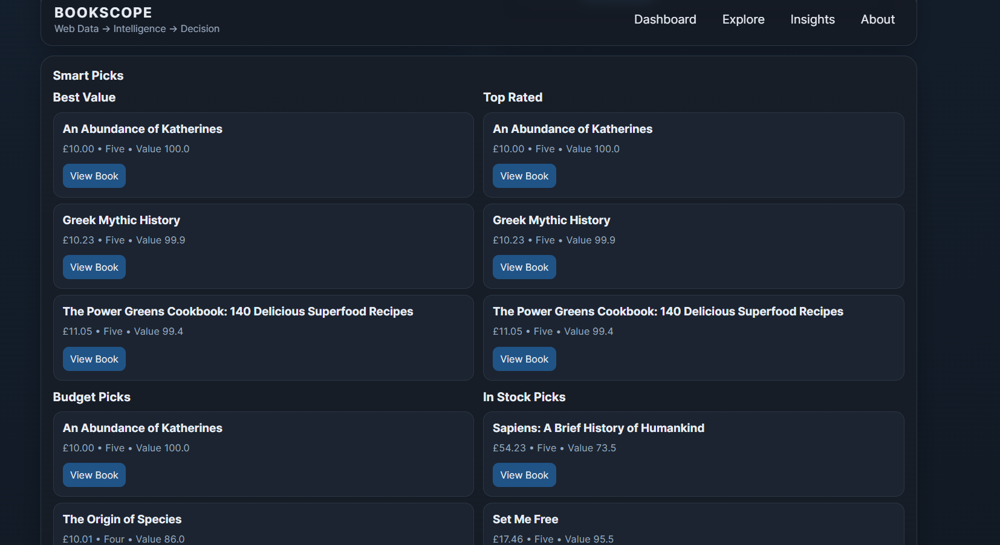
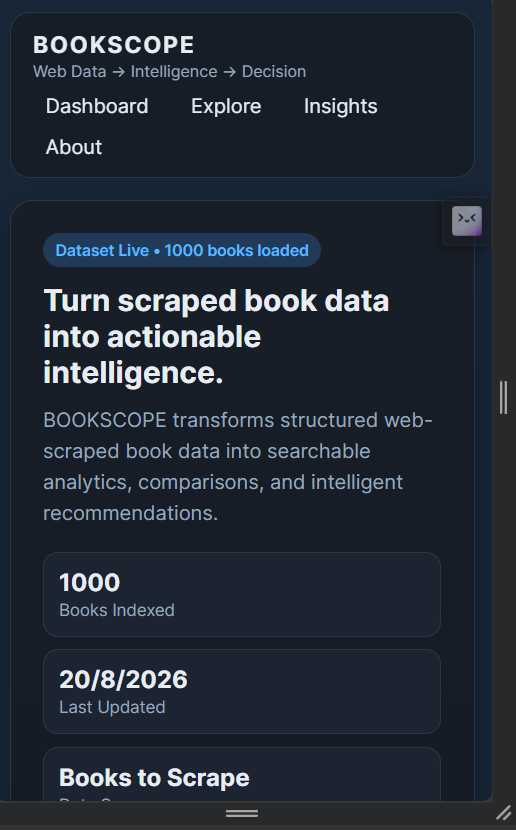

# 📚 BOOKSCOPE
### Turn scraped book data into actionable intelligence.


An interactive web analytics dashboard that transforms structured book data into searchable insights, comparisons, visual analytics, and recommendations.

---

## 🔗 Live Demo
### 👉 [View BookScope Live](https://nickroy07.github.io/books-web-scraper/)

---

## 🖼️ Screenshots

**Dashboard**


**Analytics**


**Insights & Book Explorer**


**Data Pipeline / About**


**Smart Picks**


**Mobile View**


---

## ❓ Problem

Raw scraped product data (like from an e-commerce book catalog) is hard to make sense of on its own. A plain list of titles, prices, and ratings doesn't tell you which books are actually worth buying, how prices and ratings relate, or what's trending in stock — someone has to manually dig through it to find anything useful.

## 💡 Solution

BookScope takes structured book data collected via **Bright Data Scraper Studio** and turns it into a full analytics dashboard — with search, filters, visual charts, and smart recommendation logic — so users can explore and understand the dataset in seconds instead of scrolling through raw rows.

---

## ✨ Key Features

**📊 Overview KPIs**
- Total Books
- Average Price
- Average Rating
- In-Stock Percentage
- Highest-Rated Book
- Lowest-Price Book

**🔎 Search & Filter**
- Title search
- Rating filter
- Min/Max price filter
- Availability filter
- Sorting options

**📈 Visual Analytics**
- Price Distribution chart
- Rating Distribution chart
- Availability Distribution chart
- Rating vs. Price scatter chart

**🎯 Smart Picks**
- Best Value
- Top Rated
- Budget Picks
- In Stock Picks

**🧠 Book Intelligence**
- Value Score for each book

**📖 Book Explorer**
- Browse full dataset with direct links to original product pages

**🔄 Transparent Data Pipeline**
- Dashboard shows how the data flows from scraping to insights

---

## 🏗️ Architecture

```
Target Website (Books to Scrape)
            ↓
   Bright Data Scraper Studio
            ↓
   Structured CSV / JSON Data
            ↓
      Data Processing
            ↓
     BOOKSCOPE Dashboard
            ↓
   Insights & Recommendations
```

The scraper collects structured data (title, price, rating, availability, product URL) which is exported as CSV/JSON. The frontend dashboard reads this dataset directly and powers all filters, KPIs, charts, and smart recommendations — no backend server required.

---

## 🗂️ Dataset

Data was collected from **Books to Scrape** using **Bright Data Scraper Studio**, capturing:

- Title
- Price
- Rating
- Availability
- Product URL

Main dataset (1000 books): `data/j_msx13h3f10nyknkkpk.csv`
Sample dataset: `data/example-output.json`

---

## 🛠️ Tech Stack

| Layer | Technology |
|---|---|
| Data Collection | Bright Data Scraper Studio |
| Data Storage | CSV / JSON |
| Frontend | HTML, CSS, JavaScript |

---

## 🚀 How to Run

```bash
# Clone the repository
git clone https://github.com/nickroy07/books-web-scraper.git
cd books-web-scraper

# Start a local static server (recommended)
python -m http.server 8000
```

Then open:
```
http://localhost:8000/frontend/index.html
```

> ⚠️ Opening `frontend/index.html` directly by double-clicking may not load the dataset correctly due to browser restrictions on local file access — running it through a local server is recommended.

The live version is also deployed via **GitHub Pages**, where the root `index.html` redirects to `frontend/index.html`.

---

## 👥 Team

| Name | Role |
|---|---|
| Nikhil Chandrakant Mahale | Team Lead — Bright Data setup, GitHub repo & integration |
| Tejal | Frontend — UI/Dashboard development |
| Awaj Aekram | Presentation — PPT, demo script & speaking |
| Apeksha Kaushik | Testing & Documentation — Data testing, README, and submission evidence |

---

## 🙏 Acknowledgments

- **[Books to Scrape](http://books.toscrape.com/)** — the source website used for the dataset
- **Bright Data Scraper Studio** — for structured data collection
- Built as part of a hackathon submission by Team BookScope

---

## 🔮 Future Improvements

- Live/scheduled scraping instead of static dataset
- Backend + database for persistent storage
- User accounts and saved book lists
- Price-drop tracking and alerts
- Expanded dataset beyond a single source site

---

## 📄 License

This project is licensed under the **MIT License** — see the [LICENSE](LICENSE) file for details.

---

## 📁 Project Structure

```
books-web-scraper/
│
├── index.html                    (redirects to frontend/index.html — for GitHub Pages)
│
├── data/
│   ├── example-output.json
│   └── j_msx13h3f10nyknkkpk.csv
│
├── frontend/
│   ├── index.html
│   ├── Script.js
│   ├── style.css
│   └── README.md
│
├── scraper/
│   └── interaction-code.js
│
└── README.md
```
